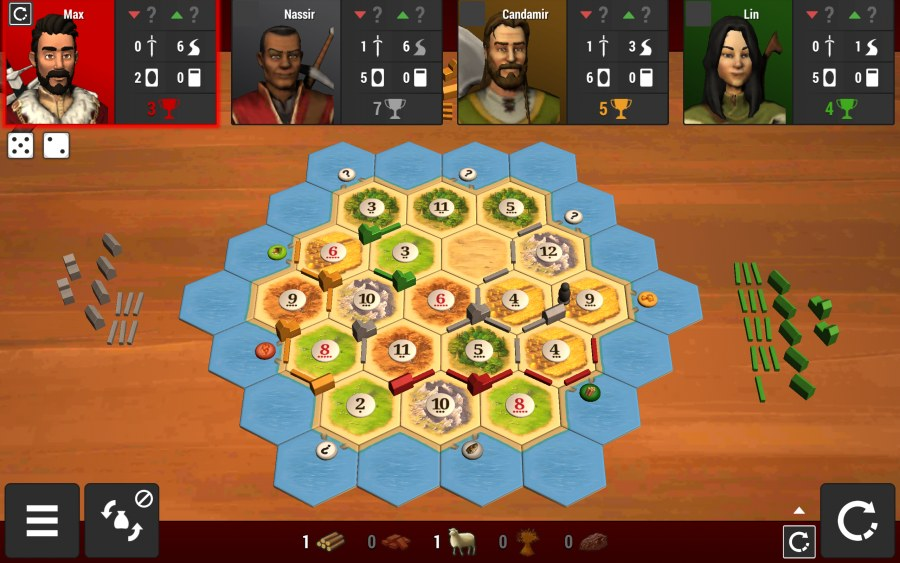
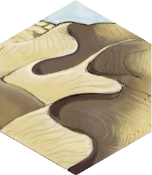
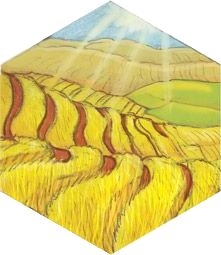
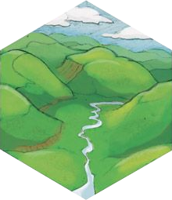
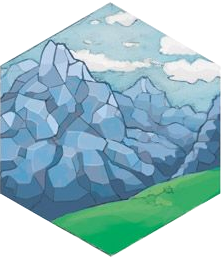

# Title: The Settlers of Catan Online
- Repository: `catan-online` 
- Type of Challenge: `Consolidation Project`
- Duration: `8 days`
- Team challenge : `Group`

## Learning Objectives:
 - handling responsibilities in large group project
 - using all knowledge gained over duration course
 - large group task requiring planning and collaboration
 - WebSockets, Animations, ...

## Mission statement
Welcome to the Catan Online project.
We will be making an online playable version of Settlers of Catan.
Read this assignment very carefully and plan ahead.

Because the huge scope it is recommended to plan the first day your user stories, trying to keep frontend and backend tickets seperate.
It would also be really helpful the first day to plan with your team your database schedule.
Don't be afraid afterwards to ask your coach for verification.

I already prepared some sprites for you to use as the game board, for the cards we will be using plain text (you can always make your own graphics!)

Divide the tasks! let one part of the team work on visualizing the site, and the other making a backend which will actually make it playable. 

Make sure all decisions are made in the backend (like dice rolls), and no informationa about other players is leaked (like their hand) to prevent cheating.

Remember on a project of this size everybody counts! 
So even if you feel inadequate you can still make the difference between success and failure!

## Two modes of operation
There are 2 ways of tackling the global architecture for this project, a more simple limited way, and a more advanced mode with Websockets.

- A classical mode where most actions trigger a page reload. Inactive players can have either a fetch that runs every X seconds to check for changes and update the view, or just refresh the page.
  Downside is many refreshes and actions are not communicated in real time to other players. The game might feel "clunky".
- (Hard) A more advanced way would be to use WebSockets (for JS, look into [socket.io](https://socket.io/), for PHP look into [ReactPHP](https://reactphp.org/)). This allows real time communication between the players. This is online, So if one player disconnects don't kill the game!

## Core components:
For those who have never played settlers before. [Watch this short video.](https://www.wired.co.uk/article/beginners-guide-to-settlers-of-catan)

 - First the Board:
    - which has (19) Tiles (resources)
        - Forest(4) ->  Lumber
        - Hills(3) ->  Brick
        - Pasture(4) -> Wool
        - Fields(4) -> Grain
        - Mountains(3) -> Ore
            - on these tiles Chits(numbers) are placed.
    - An edge to the "field"
        - Docks(9) -> At the edge(fixed location) for fixed trading.
     - Player objects:
        - Roads
        - Villages
        - City's
        - Robber(Thief)
        
 
 
 - Then the players(2-4):
    - They have resource cards.  (Gained)
    - Development cards (Bought)
    - Points (Gained)(0 - 10)
    
 - Mechanics:
    - Turn based game (except trading)
    - Start of turn -> Dice roll for resources, Propose trading, building / buying cards -> next player.
    - Keeping track of win conditions and resources per player
    - A visual interface for clearly showing the possible actions available to a player.(see example)
      

This example is in 3D and has a lot of fancy extra's. Ours will be 2D and more basic. So don't start stressing, you yourself decide the difficulty.

## Flow
### Starting the game
1. Generate the map
2. Generate the random numbers on the map
3. Being able to place villages and roads on valid spots (check gamerules).
4. Color code the roads and villages by players (you can use [CSS filter](https://css-tricks.com/almanac/properties/f/filter/))
5. Give start resources to each player

### Game round
1. Throw dice
    1. In case of 7, move robber and steal a card from a targeted player.
    2. All other cases, gives resources to players
2. Player has several actions now:
    1. Build a road (This might give him the longest trade route)
    1. Build a village
    1. Upgrade a village to a city
    1. Purchase a development card
    1. Play a development card (implementation of those is a perfect candidate for polymorphism)
       1. Knight cards (activate the robber), check if player now gets largest army points. There should be a visual indication how many knights you have played.
       1. Victory cards (Do NOT show this extra point to other players, only visible at the end of the game)
       1. Other development cards (see picture below)
    1. Trade (can trade with harbor or with other players)
       - Most easy would be to provide a window where the active player can put both demanded and offered card(s) in a trade window. The other players then take it or leave it. The first player to click gets the trade.
       - Another more complicated mode would be to provide the function of counter offers, other players can switch cards in the offer. Be careful, a trade can never happen between 2 inactive players.
    1. End of turn button (maybe provide some timer so a player cannot just go away from his computer)    
    
**Constantly check the win condition of the active player!**

 
# Sources

1) The rules to The Settlers of Catan 
    - Read the following [Game Rules & Almanac](catan_base_rules_2020_200707.pdf)
3) Keywords: WebSockets, Canvas, Sprites, Interaction, ...

Find some [icons online](https://game-icons.net/tags/catan.html) (or make your own).

One of *the hardest parts* of this assigment is representing the hexagons of the game world.
I would recommend assigned to person with the greatest insight into algorithms to look into this as quickly as possible.
You can find good advice on [this online article](https://www.redblobgames.com/grids/hexagons/#coordinates).

# Nice to have 
- Sound effects
- Visual dice rolls
- Chat
- Accounts with statistics (wins, prefered color, avatar picture ...)
  
