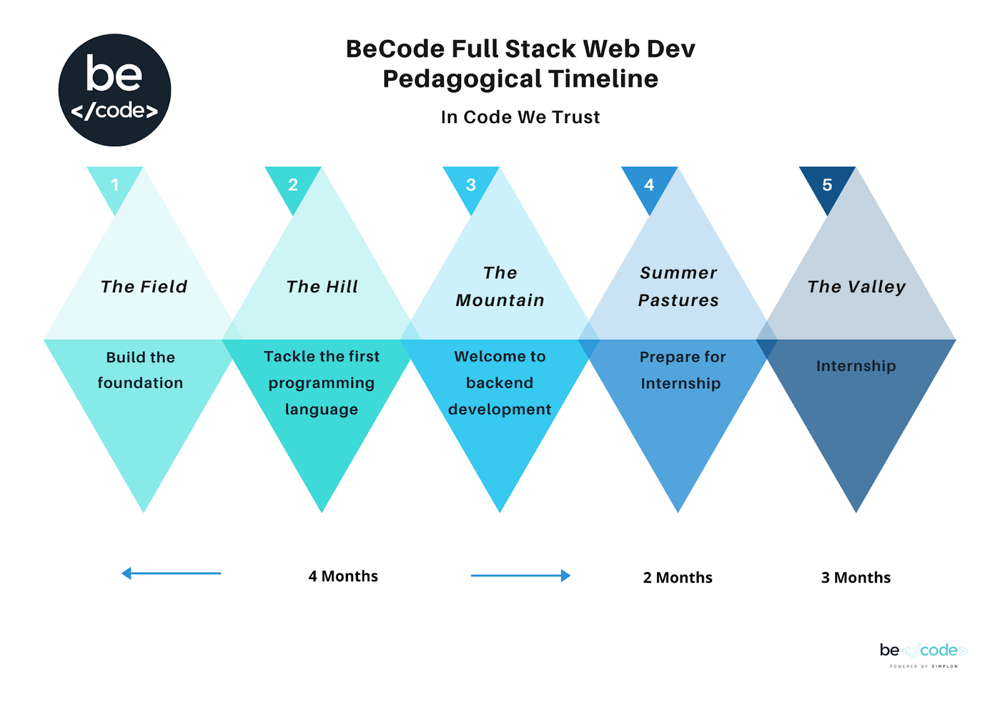

# Startup Antwerp Lamarr

This repo is the source of information about activities with BeCode: Briefings, guidelines, tasks, tutorials, exercises etc...
Clone this to your pc and `git pull` often to make sure you have the most recent version.

# Covid
Here is [the presentation of all the covid rules and protections we took on the campus](Extra-Info/BlendedModelRulesOnCampus.pdf).

# Agenda
To keep up to date with current events please check the [agenda](Extra-Info/agenda.md).

# Your sources of info for BeCode:

- [Review form after an exercise](https://forms.gle/EAKWsu2cCQcQVHtm9): optional but greatly appreciated!
- [The list of the watch](Extra-Info/the-watch.md)
- [Presentation about the Rules](https://docs.google.com/presentation/d/1uZ6WXd3QqddGFMb5iFBBf_O-7Zz5sTCfOZt66xHwKD4)
- [Pedagogical contract in English](Extra-Info/contract.md)
- [Registration Form](https://becode.typeform.com/to/ltkjYW)
- [Php storm presentation](https://docs.google.com/presentation/d/1-C1ooQTMdAVjkGlDUyLLWBvbAnd6mm1Qn7XCL9KGc90/edit?usp=sharing)
- [Discord manual](https://becodeorg.github.io/Discord-Decoded/)

# Learning how to get information

- [How to master google](Extra-Info/How-To-Master-Google.md)
- [Writing a good readme](Extra-Info/Writing-A-Good-Readme.md)
- [Tips about soft skills](Extra-Info/softskills.md)

## Respect for planning: being late & absence

In case of delay, absence or early leave (planned or not), please warn us by using the platform [my.becode.org](https://my.becode.org).

In short here is what you do in any of the three cases above:

1) Send a message to both coaches on Discord
2) You warn BeCode through [my.becode.org](https://my.becode.org/);
    - if you already have some note to justify your absence (doctors note, ...), then send this straight to us using the platform (my.becode.org)
    - if you know that you are going to obtain such document, tell us when you notify us of your absence, ...  Once you have the document, send it to us through the platform
    - When you know that you will have no legal reason for the absence, tardiness, ... then please let us know asap as well on discord. Not showing up, or showing up late is considered unprofessional

**Reminder**:

 - 2 occasions of being late or leaving early unjustified is seen as an absence
 - 4 unjustified absences leads to a one-on-one conversation
 - 6 unjustified absences leads to a termination of your contract with us and the vdab and results in you leaving this training permanently.

## Vacation
There are 2 vacation blocks of one week:

- 1 - 5 march
- 24 - 28 may

---

Remember, we NEVER give up! ;)
